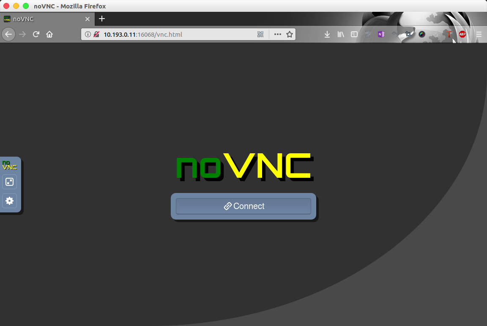
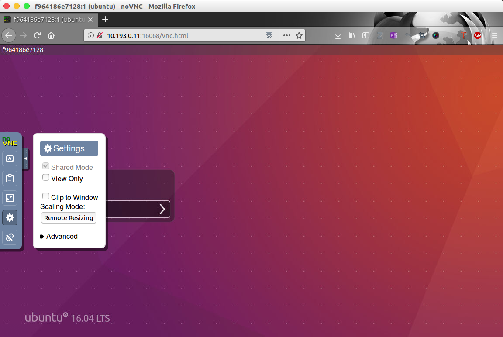
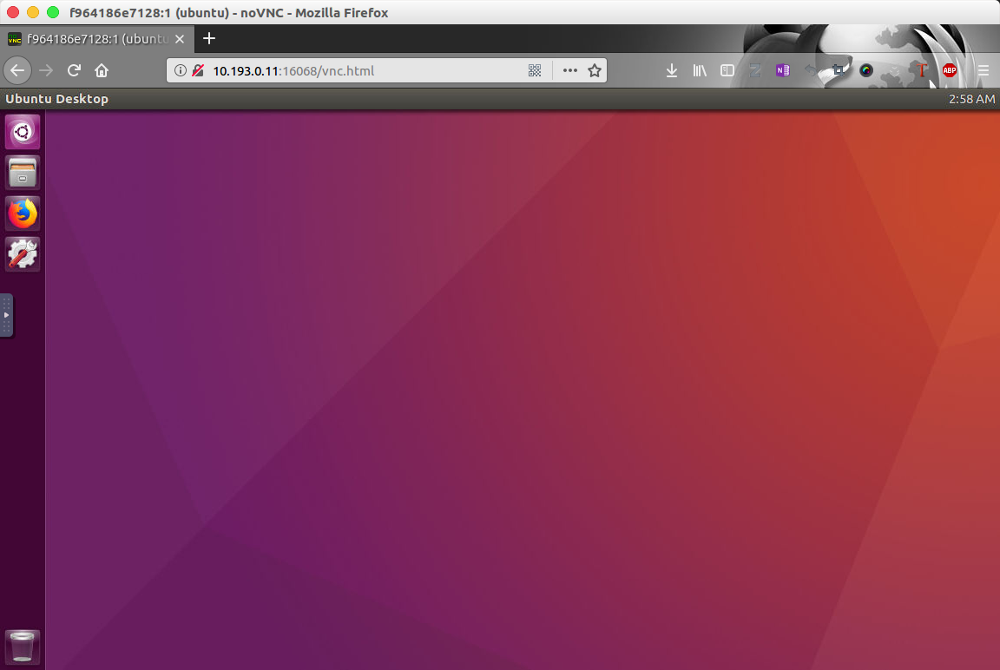
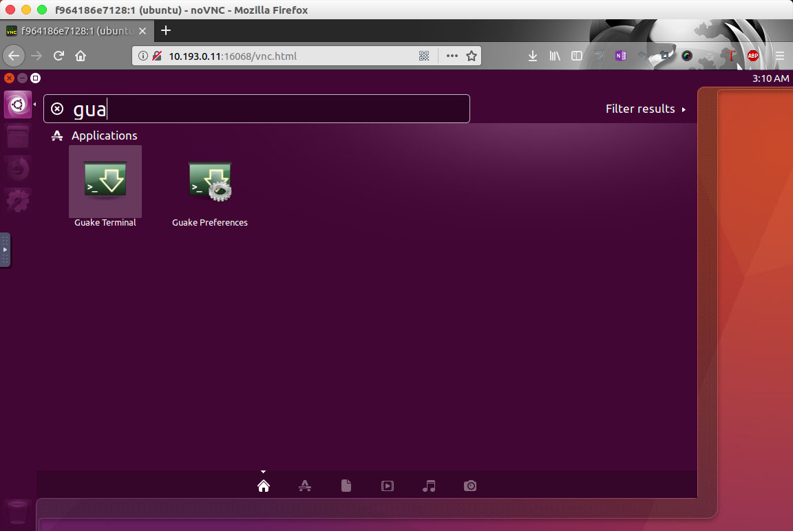
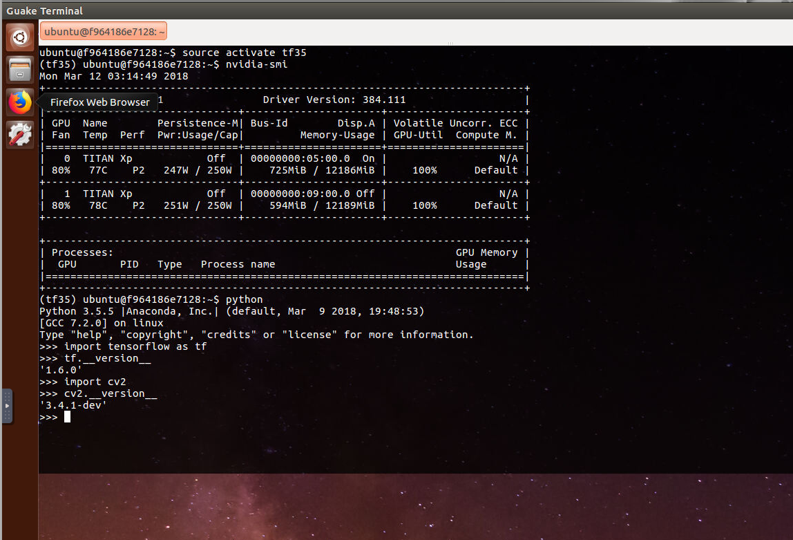
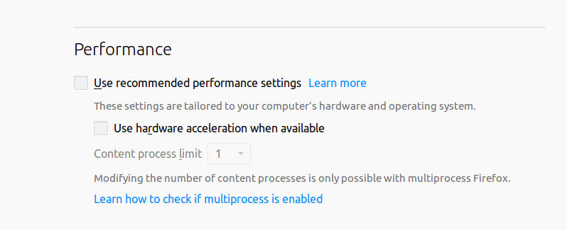

# Nvidia-docker-Ubuntu 16.04-Unity-Desktop-TensorFlow with GPU

Dockerfile for Ubuntu with Unity desktop environment for deep learning task using TensorFlow and OpenCV 3. 

This **Dockerfile** aims to create a container for **Deep Learning with Tensorflow** with **Unity Desktop** and using **TightVNCServer**, **noVNC**, **Ngrok(Optional)** which allow user to use browser to log into this container. And the container uses **Ubuntu 16.04**, we configure Tensorflow 1.6 and OpenCV 3.4 for you!

> ### Environment
>
> - CUDA 9.0
> - cudnn 7
>
>
> - TensorFlow 1.6
> - OpenCV 3.4
> - Python 3.5
> - Python 2.7
> - Guake, Tilda, XTerm, UXTerm terminal
> - Chinese character support
> - Firefox browser


## How to build?

First, your computer should have at least one Nvidia video card with compute capability greater than or equal to 3.5 and installed proper driver (higher than 384.81 version) for it. 

Second, you need to install Nvidia-docker following the instructions on this web page: [Nvidia Docker](https://github.com/nvidia/nvidia-docker/wiki/Installation-(version-2.0))

After installing Nvidia-docker, you can build this **Dockerfile**:

```
sudo nvidia-docker build -t leeochang/deep_learning:v0.1 .
```

Or, just pull my **image**:

```
sudo docker pull leeochang/deep_learning:v0.1
```

## How to use?

The default usage of this image is:

```
sudo nvidia-docker run -itd -p 16068:6080 -e PASSWORD=0000 -e SUDO=yes leeochang/deep_learning:v0.1
```

> **Tips:**
>
> "-e PASSWORD =0000"  aims to set a password as "0000" for you.
>
> (This password is for noVNC login and system login.)
>
> "-e SUDO=yes" aims to let you login as a user with root permission. (**Recommended**)

Wait for a few seconds, you can access http://[your ip address]:16068/vnc.html and see this noVNC login screen:



Then click the "Connect" button and input you noVNC password "0000", then you get the system login page.  If you want the system with adaptive resolution, select "Remote Resizing" option in the control bar on the left side of your browser.




Input your system login password("0000" if you follow this guide). Then you can log into the system.



> If you don't set "-e PASSWORD=$your_password" option,  the password will create randomly, to find it, please use the following command:
>
> ```shell
> sudo docker exec $CONTAINER_ID cat /home/ubuntu/password.txt
> ```
>
> And if you don't set "-e SUDO=yes" option, you cannot use "sudo" command in the system.

## Terminals

For gnome terminal doesn't work, we install guake for you. First search guake and click to start it. Then use "F12" to show or hide the terminal.




## Password Changing

You can change your system login password by using:

```shell
passwd
```

And input new password following the hints. (New password should be at least 8 numbers or letters).

**Note:** You can just change the system login password, but can't change the noVNC login password.

## Deep Learning Environment

```shell
nvidia-smi

python3
> import tensorflow as tf
> tf.__version__
> import cv2
> cv2.__version__
```




## Other options

#### Ngrok

[Ngrok](https://ngrok.com/) can be used to deploy local host to the Internet.

If you need to use this image across the Internet, Ngrok is what you need.

To enable Ngrok, use following command:

```
sudo docker run -itd -p 80:6080 -e NGROK=yes leeochang/deep_learning:v0.1
```

And find the link address:

```
sudo docker exec $CONTAINER_ID cat /home/ubuntu/ngrok/Ngrok_URL.txt
```

**NGROK=YES**, **NGROK=Yes**, **NGROK=Y**, **NGROK=y** are also supported.

 **Caution!!** this may also cause security issues, use it carefully.

#### Lock Screen

```shell
gnome‐screensaver‐command ‐l
```


#### Anaconda

If you want to use Anaconda to manage your python environment, first install Anaconda and create a virtual environment, for example "conda create -n tf35 python=3.5". Then you should copy "/usr/local/lib/python3.5/dist-packages/cv2.so" and "/usr/local/lib/python3.5/dist-packages/cv2.cpython-35m-x86_64-linux-gnu.so" to "$your_Anaconda_path/env/tf35/lib/python3.5/site-packages" directory. And you cannot use **OpenCV** this way for python version higher than 3.5 but only **lower or equal to 3.5**.

If you use jupyer, you should use "jupyter notebook **--ip=0.0.0.0**" to start the notebook. And if you use jupyter notebook, I suggest that you map the port 8888 out to your host and access jupyter notebook by your local host browser for the Firefox browser in the container often crashes.

#### File Transportation

> Need to expose port 22 of the container.

Use "scp" command if your system is os X or Linux.

Use [MobaXterm](https://mobaxterm.mobatek.net/) for windows user.


## Issues

Some components of Unity may not work properly with vncserver.

## Fix the crash problem of Firefox Browser

Sometimes you meet tab crash problem with Firefox:


To fix that, you need to input "about:preferences" in the address bar and press enter, and cancel the tick of the following options:



And input "about:config" in the address bar, double click to modify the following options:

- browser.tabs.remote.autostart = false
- browser.tabs.remote.autostart.2 = false (Optional)
- webgl.disable-wgl = true
- webgl.disabled = true
- webgl.enable-webgl2 = false

Finally, restart Firefox, hope solve the crash problem!

